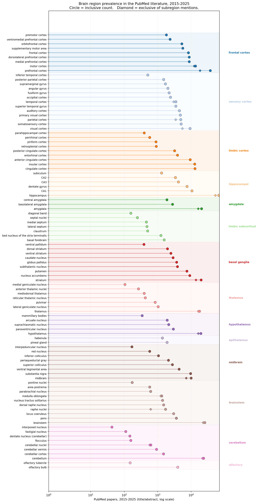

# neuro-whitespace

Bibliometric prevalence analysis for ~100 brain regions in the PubMed
literature, 2015–2025. The point is to spot which regions get a lot of
attention and which are relative whitespace, while avoiding the most
obvious pitfalls of naive PubMed counting.



Circle = inclusive count for the term. Diamond = count after subtracting
mentions of the term's named subdivisions (only shown where it differs
from the inclusive count). Categories are colored bands.

## Headline results (PubMed, 2015–2025)

Top 15 by inclusive count:

| Rank | Region                       | Inclusive | Exclusive of subregions |
|-----:|------------------------------|----------:|------------------------:|
| 1    | hippocampus                  |    66,791 |                  55,626 |
| 2    | prefrontal cortex            |    37,338 |                  18,339 |
| 3    | brainstem                    |    25,661 |                  21,374 |
| 4    | cerebellum                   |    23,511 |                  21,799 |
| 5    | amygdala                     |    20,400 |                  16,310 |
| 6    | striatum                     |    19,841 |                  13,876 |
| 7    | hypothalamus                 |    19,588 |                  16,336 |
| 8    | thalamus                     |    17,757 |                  16,325 |
| 9    | cingulate cortex             |    13,031 |                   1,718 |
| 10   | insular cortex               |    12,723 |                  12,723 |
| 11   | motor cortex                 |    12,005 |                  10,939 |
| 12   | midbrain                     |    10,049 |                   7,137 |
| 13   | substantia nigra             |     9,612 |                   9,612 |
| 14   | visual cortex                |     9,247 |                   6,116 |
| 15   | nucleus accumbens            |     9,109 |                   9,109 |

The most striking inclusive-vs-exclusive gap is **cingulate cortex**:
13,031 inclusive papers, but only 1,718 of those don't already mention
ACC or PCC. The umbrella term is almost never used on its own.

Bottom 5 by inclusive count (across all 98 regions tracked):

| Rank | Region                       | Inclusive | Category   |
|-----:|------------------------------|----------:|------------|
|   1  | interposed nucleus           |        43 | cerebellum |
|   2  | medial geniculate nucleus    |       105 | thalamus   |
|   3  | fastigial nucleus            |       111 | cerebellum |
|   4  | dentate nucleus (cerebellar) |       147 | cerebellum |
|   5  | olfactory tubercle           |       150 | olfactory  |

Three of the five are deep cerebellar nuclei. Cerebellum-as-an-umbrella
gets 23,511 papers, but its named compartments are nearly invisible in
the literature.

Whitespace candidates (under ~300 papers across the whole decade):

- Cerebellar deep nuclei — interposed (43), fastigial (111), dentate
  (cerebellar) (147)
- Diagonal band (157), septal nuclei (247), olfactory tubercle (150),
  flocculus (157)
- Medial geniculate (105), interpeduncular (170), pontine nuclei (173)
- Anterior thalamic nuclei (266), mediodorsal thalamus (396)
- **CA2 hippocampal subfield (1,066)** — small relative to CA1 (8,334)
  and CA3 (2,896), but the gap is real, not a query artifact

The full ranking is in `regions.csv`.

## What's in here

- `run.py` — single-file pipeline. Builds queries, calls NCBI ESearch,
  normalizes counts, and renders a category-grouped lollipop chart.
- `queries.json` — every query string (inclusive and exclusive), saved
  before any fetch.
- `regions.csv`, `regions.json` — per-region counts, log-normalized
  values, and the exact ESearch URLs used.
- `prevalence.png` — the chart.

## What the pipeline does differently from a naive count

1. **Recent-window restriction.** All queries are ANDed with
   `("2015"[PDAT] : "2025"[PDAT])` so historically entrenched
   terminology doesn't dominate purely by accumulation.
2. **Hierarchy-aware exclusive counts.** For umbrella terms (e.g.
   "prefrontal cortex", "hippocampus", "cerebellum", "brainstem"), the
   pipeline also computes an *exclusive* count that subtracts mentions
   of the umbrella's named subdivisions:
   `(umbrella_term) NOT (subdiv_1 OR subdiv_2 OR …)`.
   The inclusive/exclusive gap shows how much of an umbrella's literature
   is really about a specific subdivision.
3. **Disambiguated abbreviations.** Bare abbreviations (PFC, VTA, NAc,
   ACC, …) are searched as `"ABBR"[tiab] AND (context_terms[tiab])`, so
   "ACC" doesn't pull in acetyl-CoA carboxylase papers and "VTA" doesn't
   pull in unrelated TLAs.
4. **No cartoon brain.** The output is a category-grouped lollipop on a
   log axis. Circles are inclusive counts, diamonds are exclusive of
   subregions where applicable. Coordinates were never anatomically
   accurate; not pretending they are.

## Running it

```bash
python3 run.py --email YOUR_EMAIL@example.com --out-dir .
```

Optional:

- `--api-key NCBI_API_KEY` — bumps the rate cap from ~3/s to ~10/s.
- `--sleep 0.34` — seconds between requests; default works without an
  API key.
- `--dry-run` — print the queries without calling NCBI.

Runtime: ~60 seconds for 98 regions on the default rate.

Dependencies: Python 3.9+ and `matplotlib`. Standard library handles the
HTTP, JSON, CSV, and SVG-free plotting path.

## Caveats

These counts are a bibliometric proxy for *term prevalence*, not
scientific importance, citation impact, or anatomical ground truth.

Specific things to keep in mind:

- **CA1 / CA2 / CA3 use a hybrid query.** PubMed normalizes calcium
  tokens like `Ca2+` to overlap with the CAn pattern, so a naive
  `"CAn"[tiab] AND hippocamp*` filter leaks calcium-signaling papers.
  Phrase-only matching is the other extreme and undercounts legitimate
  papers that say "Ca2+ imaging in CA2 of hippocampus" without matching
  one of the canned phrases. The pipeline matches the canonical phrase
  forms PLUS the bare abbreviation guarded by subfield-architecture
  anchors (Schaffer collateral, stratum pyramidale, mossy fiber,
  perforant path, place cell, social memory, …) — vocabulary that
  essentially never appears in unrelated calcium papers. See
  `CA_SUBFIELD_ANCHORS` in `run.py`.
- **Subdivisions can co-occur.** A paper mentioning both CA1 and CA3
  counts toward each. The exclusive-of-subdivisions logic only operates
  parent→child, not sibling→sibling.
- **Some abbreviations are intentionally omitted.** Heavily ambiguous
  short tokens (M1, S1, A1, V1, OFC, STG, SMA, …) are not searched in
  bare form — the canonical phrases ("primary motor cortex", etc.) carry
  the load. This trades coverage for precision.
- **Title/abstract only.** Full-text mentions are not considered.
- **Counts drift.** PubMed grows daily and re-indexes occasionally, so a
  re-run will produce slightly different numbers. The CSV records the
  query date.

## Related work

Other bibliometric and text-mining analyses of the neuroscience
literature, in roughly increasing distance from this project:

- **Simpson et al. (2021)** is the closest prior work I'm aware of:
  they ran a PubMed term-count analysis over Allen Mouse Brain Atlas
  region names and found that nine regions account for ~75% of
  publications while the remaining 188 regions share the rest. The
  paper argues for unbiased whole-brain methods to identify the
  overlooked regions. *Front. Syst. Neurosci.* 15:595507.
  doi:[10.3389/fnsys.2021.595507](https://doi.org/10.3389/fnsys.2021.595507)
- **Yarkoni et al. (2011)**, Neurosynth — the canonical large-scale
  text-mining + meta-analysis of the human neuroimaging literature,
  mapping cognitive terms to activation coordinates.
  *Nat. Methods* 8:665–670.
  doi:[10.1038/nmeth.1635](https://doi.org/10.1038/nmeth.1635)
- **Dockès et al. (2020)**, NeuroQuery — a comprehensive predictive
  model of the human brain-imaging literature, extending Neurosynth
  toward rarer terms. *eLife* 9:e53385.
  doi:[10.7554/eLife.53385](https://doi.org/10.7554/eLife.53385)
- **French & Pavlidis (2012)** mapped >100,000 brain-region mentions
  from the *Journal of Comparative Neurology* literature to formal
  neuroanatomical identifiers, addressing the same nomenclature and
  disambiguation problems this pipeline has to handle.
  *J. Comp. Neurol.* 520(8):1772–83.
  doi:[10.1002/cne.23012](https://doi.org/10.1002/cne.23012)
- **French et al. (2009)** built an annotated corpus and an automated
  recognizer for brain-region mentions in neuroscience abstracts.
  *Front. Neuroinform.* 3:29.
  doi:[10.3389/neuro.11.029.2009](https://doi.org/10.3389/neuro.11.029.2009)
- **Stoeger et al. (2018)** is the parallel story for genes: across
  ~20,000 human protein-coding genes, attention is concentrated on a
  small set, and the bias is largely historical rather than biological.
  *PLoS Biology* 16:e2006643.
  doi:[10.1371/journal.pbio.2006643](https://doi.org/10.1371/journal.pbio.2006643)
- **Crick & Koch (2005)**, "What is the function of the claustrum?",
  is the canonical "small region, big mystery" piece — claustrum
  shows up here at 502 papers/decade despite a long history of being
  flagged as functionally important. *Phil. Trans. R. Soc. B*
  360:1271–1279.
  doi:[10.1098/rstb.2005.1661](https://doi.org/10.1098/rstb.2005.1661)
- **Hitti & Siegelbaum (2014)** showed that hippocampal CA2 is
  required for social memory, sparking the modern wave of CA2 work
  that shows up in our 1,066-paper count. *Nature* 508:88–92.
  doi:[10.1038/nature13028](https://doi.org/10.1038/nature13028)

What this project adds that those don't: a small, transparent,
re-runnable script with explicit phrase + abbreviation rules per
region, and an explicit hierarchy that lets you read off how much of
an "umbrella" region's literature is really about a named subdivision.
The numbers are crude relative to NeuroQuery's coordinate-based
modeling, but you can audit and tweak every query in `run.py` and
re-run in under a minute.

## License

MIT. See `LICENSE`.
